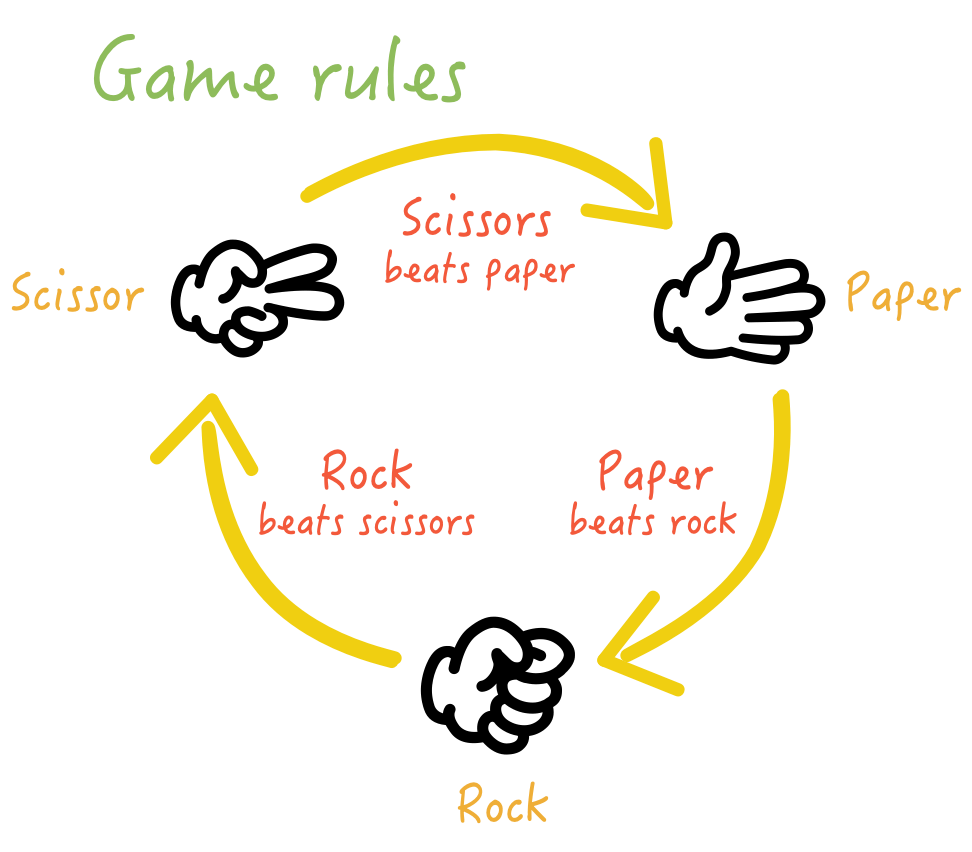

# RockPaperScissorsByMert
Simple Rock Paper Scissors game implementation in Python console 

## Input and Output

The player enters the either one of the following commands:

- **_r_** or **_rock_**
- **_p_** or **_paper_**
- **_s_** or **_scissors_**

The commands are ***CASE INSENSITIVE***

